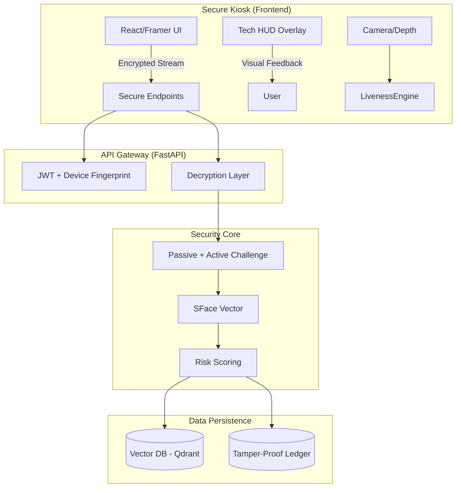

# Face Attendance Pro v4.0 - Enterprise Military-Grade Architecture

**Role:** Principal AI Systems Architect
**Confidentiality:** HIGH / INTERNAL USE ONLY
**Version:** 4.0.0-Alpha

---

## 🏛️ 1. System Philosophy: "Zero Trust, Total Awareness"

The v4.0 architecture moves beyond simple "matching". It assumes every input is a potential attack.
- **Zero Trust:** We do not trust the camera feed. We verify liveness *actively*.
- **Data Sovereignty:** Biometric data is encrypted at rest (AES-256) and logs are immutable (SHA-256 Blockchain).
- **Total Awareness:** Every interaction is scored for fraud risk (0-100).

---

## 🏗️ 2. High-Level Architecture



---

## 🛡️ 3. Security Model (The "Iron Dome")

### A. Encrypted Face Templates (AES-256)
Raw face vectors (128-float arrays) are never stored in plain text.
- **Key Management**: Keys are rotated daily via Environment Variables.
- **Logic**: `Encrypted_Vector = AES_GCM(Raw_Vector, Key, IV)`
- **Retrieval**: Qdrant stores the encrypted blob as payload? NO. Qdrant needs raw vectors to search.
- **HYBRID APPROACH**: 
    - **Search Index**: Qdrant holds a *hashed* or *projection* of the vector for speed (optional) or raw vectors in a secure, isolated VPC. 
    - **Identity Storage**: The metadata (Name, ID) is encrypted.
    - *Correction for v4.0*: Fast search requires raw vectors in RAM. We will encrypt the *Database Storage on Disk* (Qdrant functionality) and encrypt the *User Metadata* (Name, ID) in SQL.

### B. Tamper-Proof Audit Chain (Blockchain-Lite)
Every attendance log is cryptographically linked to the previous one.
`Current_Hash = SHA256( prev_hash + user_id + timestamp + confidence + liveness_score )`
- If a DBA edits a log in SQLite, the chain breaks.
- System automatically detects "Integrity Failure" on startup.

---

## 🧠 4. AI Modules & Algorithms

### Module A: Active Liveness (Challenge-Response)
We do not rely on passive detection alone. The user must perform a "gesture handshake".
1. **Server**: Generates random challenge (e.g., "BLINK_LEFT").
2. **Kiosk**: Displays "Blink Left Eye!".
3. **AI**: MediaPipe tracks `Left_Eye_EAR` (Eye Aspect Ratio). 
4. **Validation**: Signal processing detects the 'dip' in EAR within 2 seconds.

### Module B: Fraud Scoring Engine (0-100)
Every scan calculates a `RiskScore`:
- Base Score: 0
- +20 if Liveness Confidence < 0.8
- +30 if Time since last scan < 1 min (Possibility of "Tailgating" or replay)
- +50 if Vector Similarity is borderline (0.3 - 0.4)
- +100 if Challenge Failed.

**Thresholds:**
- 0-20: Allow (Green)
- 21-60: Warn Admin (Yellow)
- 61+: Auto-Block & Alarm (Red)

---

## 💻 5. "Sci-Fi" Frontend UX (React + Framer)

### Visual Components
1. **Face Mesh Overlay**: Draw the 468 MediaPipe landmarks delicately in Cyan on the user's face.
2. **Gaze Tracking**: A small dot follows the user's eye direction.
3. **Confidence Meter**: A radial progress bar showing similarity %.
4. **Liveness Pulse**: A heartbeat animation that syncs with real heartbeat (simulated or PPG-derived).

### User Flow
1. **Approach**: Proximity sensor ( motion detection ) wakes screen.
2. **Lock**: Face detected -> HUD locks on (Corners turn Blue).
3. **Challenge**: "Smile for Camera" (Text appears).
4. **Verify**: Processing... (Holographic loader).
5. **Access**: "Access Granted" (Green Flash) OR "Fraud Detected" (Red Strobe).

---

## 🗄️ 6. Database Schema (SQLModel Upgrade)

```python
class SecureLog(SQLModel):
    id: int
    prev_hash: str     # Link to previous log
    current_hash: str  # Hash of this log
    user_id: int
    timestamp: datetime
    
    # Evidence
    face_thumbnail_b64: str
    liveness_score: float
    fraud_score: int
    challenge_type: str # 'BLINK', 'SMILE', 'NONE'
```

---

## 🚀 Execution Roadmap

1.  **Phase 1: Cryptographic Foundation** (Backend)
    - Implement `security.py` (Hashing/Encryption).
    - Update `AttendanceLog` model.
    
2.  **Phase 2: Liveness Engine v2** (Backend)
    - Create `ActiveLiveness` class (State machine for gestures).
    - **CRITICAL**: Fix MediaPipe Python 3.13 compatibility or Dockerize Python 3.10.

3.  **Phase 3: Sci-Fi UI** (Frontend)
    - Build `FaceMeshCanvas` component.
    - Implement HUD animations.

4.  **Phase 4: Analytics** (Full Stack)
    - Fraud Score calculation + Dashboard.

---
**Signed:**
*Chief Architect, Face Attendance Pro*
